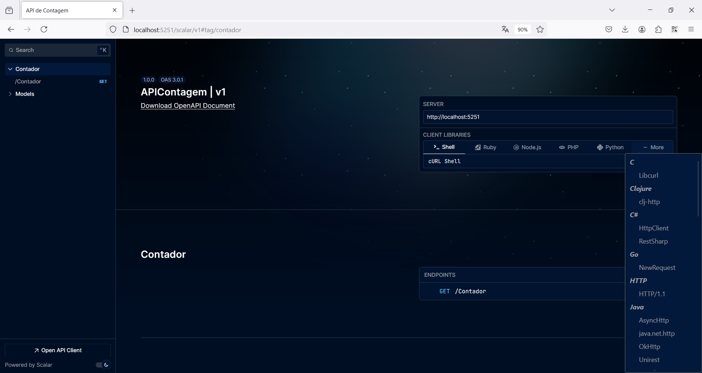
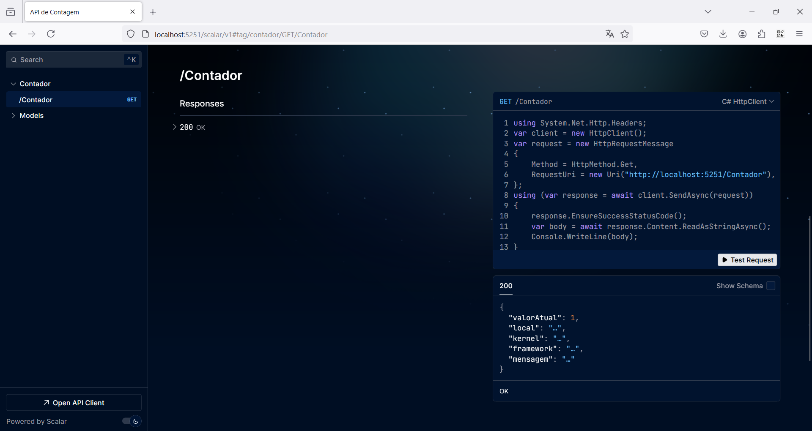
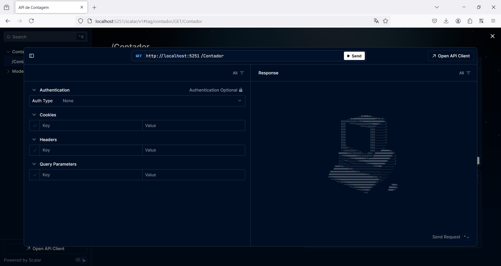
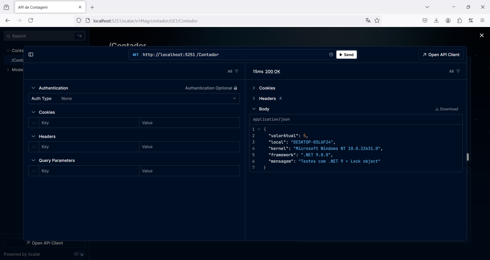

# DotNet9-ASPNETCore-OpenAPI-Scalar_APIContagem
Exemplo em .NET 9 + ASP.NET Core + C#13 de API REST de contagem de acessos e que faz uso da classe Lock (namespace System.Threading). Inclui também o uso do novo package para suporte a OpenAPI e da solução Scalar (alternativa ao Swagger), além de um Dockerfile para a geração de imagens.

---

## Alguns prints demonstrando o uso do Scalar

Endpoint: **/scalar/v1**

Tela inicial do Scalar com opções para exportação de requisições em múltiplas linguagens/scripts:

Selecionando um endpoint para teste:

Interface para testes com um endpoint:

Exemplo de teste de um endpoint:

